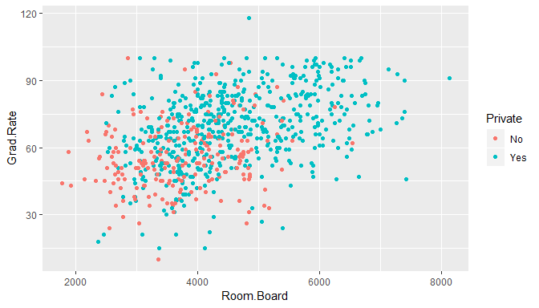
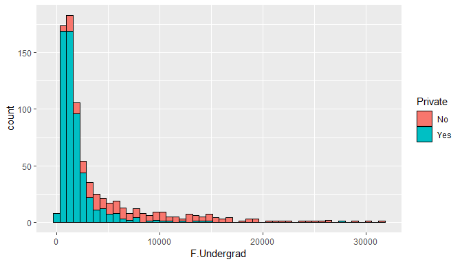
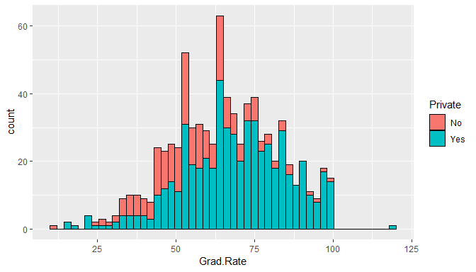
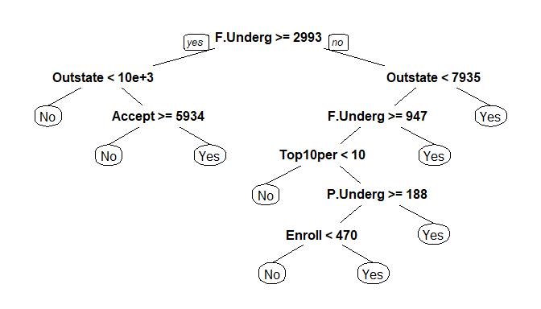

## Setup

### Load packages


```r
library(ggplot2)
library(dplyr)
library(statsr)
```

### Load data


```r
library(ISLR)
head(College)
```

```
##                              Private Apps Accept Enroll Top10perc
## Abilene Christian University     Yes 1660   1232    721        23
## Adelphi University               Yes 2186   1924    512        16
## Adrian College                   Yes 1428   1097    336        22
## Agnes Scott College              Yes  417    349    137        60
## Alaska Pacific University        Yes  193    146     55        16
## Albertson College                Yes  587    479    158        38
##                              Top25perc F.Undergrad P.Undergrad Outstate
## Abilene Christian University        52        2885         537     7440
## Adelphi University                  29        2683        1227    12280
## Adrian College                      50        1036          99    11250
## Agnes Scott College                 89         510          63    12960
## Alaska Pacific University           44         249         869     7560
## Albertson College                   62         678          41    13500
##                              Room.Board Books Personal PhD Terminal
## Abilene Christian University       3300   450     2200  70       78
## Adelphi University                 6450   750     1500  29       30
## Adrian College                     3750   400     1165  53       66
## Agnes Scott College                5450   450      875  92       97
## Alaska Pacific University          4120   800     1500  76       72
## Albertson College                  3335   500      675  67       73
##                              S.F.Ratio perc.alumni Expend Grad.Rate
## Abilene Christian University      18.1          12   7041        60
## Adelphi University                12.2          16  10527        56
## Adrian College                    12.9          30   8735        54
## Agnes Scott College                7.7          37  19016        59
## Alaska Pacific University         11.9           2  10922        15
## Albertson College                  9.4          11   9727        55
```

```r
df<-College
```


* * *

## Part 1: EDA

```r
library(ggplot2)
ggplot(df,aes(Room.Board,Grad.Rate)) + geom_point(aes(color=Private))
```

<!-- -->


```r
ggplot(df,aes(F.Undergrad)) + geom_histogram(aes(fill=Private),color='black',bins=50)
```

<!-- -->


```r
ggplot(df,aes(Grad.Rate)) + geom_histogram(aes(fill=Private),color='black',bins=50)
```

<!-- -->

Reseting Graduation rate to 100% for colleges with more than 100% college graduation rate


```r
subset(df,Grad.Rate > 100)
```

```
##                   Private Apps Accept Enroll Top10perc Top25perc
## Cazenovia College     Yes 3847   3433    527         9        35
##                   F.Undergrad P.Undergrad Outstate Room.Board Books
## Cazenovia College        1010          12     9384       4840   600
##                   Personal PhD Terminal S.F.Ratio perc.alumni Expend
## Cazenovia College      500  22       47      14.3          20   7697
##                   Grad.Rate
## Cazenovia College       118
```

```r
df['Cazenovia College','Grad.Rate'] <- 100
```

* * *

## Part 2: Splitting the data


```r
library(caTools)

set.seed(101) 

sample = sample.split(df$Private, SplitRatio = .70)
train = subset(df, sample == TRUE)
test = subset(df, sample == FALSE)
```

* * *

## Part 3: Modeling a Decision Tree

```r
library(rpart)
tree <- rpart(Private ~.,method='class',data = train)
```


Predicting the test data


```r
tree.preds <- predict(tree,test)

head(tree.preds)
```

```
##                                                  No       Yes
## Adrian College                          0.003311258 0.9966887
## Alfred University                       0.003311258 0.9966887
## Allegheny College                       0.003311258 0.9966887
## Allentown Coll. of St. Francis de Sales 0.003311258 0.9966887
## Alma College                            0.003311258 0.9966887
## Amherst College                         0.003311258 0.9966887
```
Turning these two columns into one column to match the original Yes/No Label for a Private column.


```r
tree.preds <- as.data.frame(tree.preds)
joiner <- function(x){
    if (x>=0.5){
        return('Yes')
    }else{
        return("No")
    }
}
```


```r
tree.preds$Private<-sapply(tree.preds$Yes,joiner)
```


```r
head(tree.preds)
```

```
##                                                  No       Yes Private
## Adrian College                          0.003311258 0.9966887     Yes
## Alfred University                       0.003311258 0.9966887     Yes
## Allegheny College                       0.003311258 0.9966887     Yes
## Allentown Coll. of St. Francis de Sales 0.003311258 0.9966887     Yes
## Alma College                            0.003311258 0.9966887     Yes
## Amherst College                         0.003311258 0.9966887     Yes
```


```r
table(tree.preds$Private,test$Private)
```

```
##      
##        No Yes
##   No   57   9
##   Yes   7 160
```

Plotting our tree.

```r
library(rpart.plot)
prp(tree)
```

<!-- -->

## Making a Random Forest Model


```r
library(randomForest)
```

```
## randomForest 4.6-14
```

```
## Type rfNews() to see new features/changes/bug fixes.
```

```
## 
## Attaching package: 'randomForest'
```

```
## The following object is masked from 'package:dplyr':
## 
##     combine
```

```
## The following object is masked from 'package:ggplot2':
## 
##     margin
```

```r
rf.model <- randomForest(Private ~ . , data = train,importance = TRUE, ntree=400)
```


```r
rf.model$confusion
```

```
##      No Yes class.error
## No  126  22  0.14864865
## Yes  11 385  0.02777778
```


```r
rf.model$importance
```

```
##                       No           Yes MeanDecreaseAccuracy
## Apps        0.0275386057  1.356171e-02         1.723877e-02
## Accept      0.0263254350  1.337726e-02         1.686763e-02
## Enroll      0.0323038096  2.792032e-02         2.908210e-02
## Top10perc   0.0095800563  4.509441e-03         5.916206e-03
## Top25perc   0.0066560995  3.183575e-03         4.109068e-03
## F.Undergrad 0.1461205074  7.202764e-02         9.188980e-02
## P.Undergrad 0.0377325431  5.224727e-03         1.408758e-02
## Outstate    0.1435914435  6.393959e-02         8.512601e-02
## Room.Board  0.0176882801  1.336700e-02         1.460354e-02
## Books       0.0005455828 -4.004328e-05         9.656086e-05
## Personal    0.0029786341  1.018663e-03         1.566119e-03
## PhD         0.0102402094  5.256023e-03         6.603003e-03
## Terminal    0.0042698471  4.687183e-03         4.597586e-03
## S.F.Ratio   0.0300834369  8.544310e-03         1.431950e-02
## perc.alumni 0.0222861419  3.419769e-03         8.653891e-03
## Expend      0.0239986668  1.213032e-02         1.532228e-02
## Grad.Rate   0.0179507091  5.421329e-03         8.895251e-03
##             MeanDecreaseGini
## Apps               10.474338
## Accept             11.293884
## Enroll             20.344444
## Top10perc           5.439410
## Top25perc           4.355024
## F.Undergrad        42.324059
## P.Undergrad        14.797866
## Outstate           42.872720
## Room.Board         11.221529
## Books               2.446564
## Personal            3.745507
## PhD                 4.397076
## Terminal            4.431449
## S.F.Ratio          14.833059
## perc.alumni         4.661442
## Expend             10.375426
## Grad.Rate           7.015311
```

Making Predictions

```r
p <- predict(rf.model,test)
```


```r
table(p,test$Private)
```

```
##      
## p      No Yes
##   No   55   5
##   Yes   9 164
```


